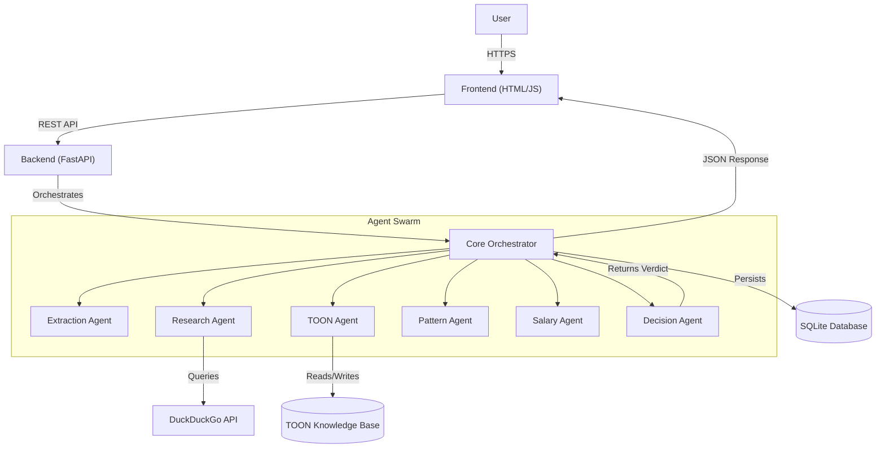
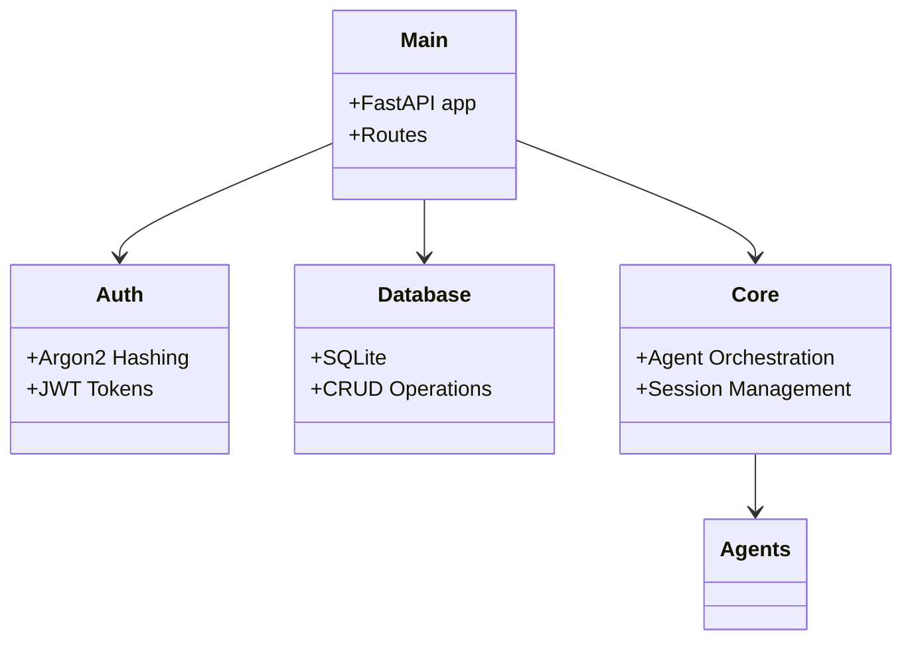
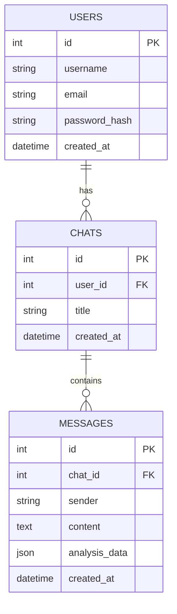
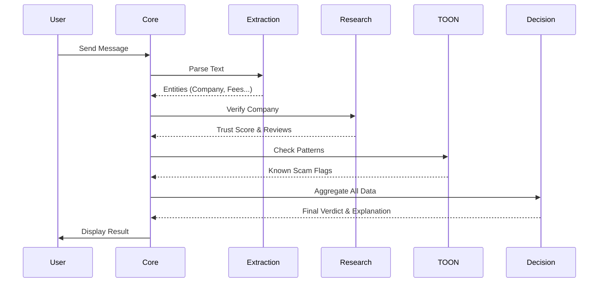
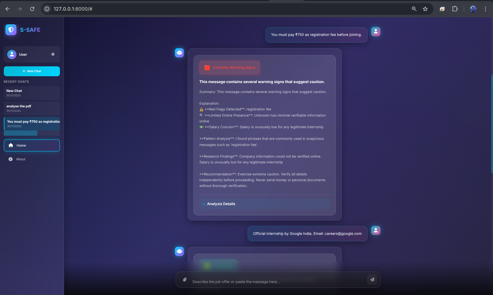

# S-SAFE: Student Scam & Fraud Eliminator 🛡️


> **An Internet-Aware Multi-Agent System to protect students from fake internships, job scams, and financial fraud.**

---

## 🚩 Problem Statement

In the digital age, students and fresh graduates are prime targets for sophisticated employment scams. Desperation for internships and entry-level jobs makes them vulnerable to:

*   **Fake Offer Letters:** High-quality forgeries that look official but demand "security deposits."
*   **"Pay-to-Work" Schemes:** Scams requiring payment for training, laptops, or "verification fees" before starting work.
*   **Identity Theft:** Phishing forms disguised as job applications to steal personal data.
*   **Impersonation:** Scammers posing as recruiters from reputable companies (e.g., Google, Amazon) on WhatsApp and Telegram.

**The Impact:**
*   **Financial Ruin:** Students losing semester fees or savings.
*   **Psychological Trauma:** Loss of confidence and anxiety.
*   **Career Delays:** Wasted time pursuing fake opportunities.

Traditional spam filters fail because they rely on static keywords. **S-SAFE** solves this by using **Agentic AI** to investigate offers contextually, verifying facts against the live internet.

---

## 🤖 Why AI Multi-Agents?

A standard Machine Learning classifier (like a spam filter) is insufficient for this problem because:
1.  **It lacks context:** It can't verify if "TechCorp Solutions" is a real company or a shell entity registered yesterday.
2.  **It's static:** It can't adapt to new scam narratives (e.g., "Crypto Task Scams") without retraining.
3.  **It's opaque:** It gives a probability score (0.85) but doesn't explain *why* something is a scam.

**S-SAFE uses a Multi-Agent System to mimic a human investigator:**
*   It **reads** the text (Extraction).
*   It **Googles** the company (Research).
*   It **consults** a knowledge base of known scams (TOON).
*   It **analyzes** the salary and patterns (Reasoning).
*   It **decides** based on evidence (Decision).

---

## 🕵️‍♀️ The 7 Agents of S-SAFE

S-SAFE orchestrates seven specialized agents to perform a comprehensive forensic analysis.

### 1. Extraction Agent 📝
*   **Purpose:** Structures unstructured text into usable data.
*   **Input:** Raw user message (email, chat, offer letter text).
*   **Output:** JSON object with `company_name`, `emails`, `fees`, `job_role`, `urls`.
*   **Logic:** Uses NLP to identify entities. It distinguishes between a recruiter's email and a generic Gmail address.

### 2. Online Research Agent 🌐
*   **Purpose:** Verifies the legitimacy of entities in the real world.
*   **Input:** Extracted `company_name` and `urls`.
*   **Tools:** DuckDuckGo Search API.
*   **Logic:**
    *   Searches for "Company Name scam", "Company Name reviews".
    *   Checks if the official website matches the one in the message.
    *   Verifies domain age and reputation.

### 3. TOON Learning Agent 🧅
*   **Purpose:** The "Librarian" of the **The Onion Of Nasty (TOON)** scams knowledge base.
*   **Input:** Extracted entities and research results.
*   **Logic:**
    *   Checks if the pattern matches known scams in `toon/patterns.json`.
    *   **Active Learning:** If a new scam pattern is confirmed (e.g., a new fake domain), it *updates* the knowledge base automatically.

### 4. Pattern Analysis Agent 🔍
*   **Purpose:** Detects linguistic and behavioral red flags.
*   **Input:** Raw text.
*   **Logic:** Uses regex and semantic analysis to find high-risk phrases like:
    *   "Kindly deposit"
    *   "Urgent wire transfer"
    *   "Communication via Telegram only"

### 5. Salary Reasoning Agent 💰
*   **Purpose:** Identifies "Too Good To Be True" offers.
*   **Input:** Job role and offered salary.
*   **Logic:** Compares the offer against market averages.
    *   *Example:* "Data Entry Intern" offering "$50/hour" is flagged as highly suspicious.

### 6. Decision Agent ⚖️
*   **Purpose:** The "Judge" that synthesizes all evidence.
*   **Input:** Outputs from all previous agents.
*   **Output:** Final Verdict (`Safe`, `Warning`, `Fake`) + Natural Language Explanation.
*   **Logic:** Weighs conflicting evidence.
    *   *Scenario:* Real company name + Gmail address + Request for money = **FAKE**.

### 7. Memory & Session Agent 🧠
*   **Purpose:** Maintains context across the conversation.
*   **Logic:** Stores chat history in the database, allowing the user to ask follow-up questions ("What did you say about the fees again?") and ensuring the agents have full context.

---

## 🔄 System Flow

The 10-step pipeline for every message analysis:

1.  **Input:** User sends a message via the Frontend.
2.  **Session Retrieval:** Backend retrieves chat history for context.
3.  **Extraction:** Extraction Agent parses entities.
4.  **Verification:** Research Agent queries the internet.
5.  **Knowledge Lookup:** TOON Agent checks for known patterns.
6.  **Pattern Check:** Pattern Agent flags linguistic triggers.
7.  **Reality Check:** Salary Agent validates compensation.
8.  **Learning:** TOON Agent proposes updates if new patterns are found.
9.  **Decision:** Decision Agent aggregates all signals into a verdict.
10. **Output:** Result is saved to DB and streamed to the Frontend.

---

## 🏗️ Architecture Diagrams

### 1. System Architecture (Full Stack)





### 2. Backend Architecture





### 3. Database Schema





### 4. Multi-Agent Sequence





## 🧅 Deep Dive Into TOON

**TOON (The Onion Of Nasty scams)** is S-SAFE's dynamic knowledge engine.

*   **Format:** Optimized JSON structures stored in `backend/toon/`.
*   **Why not simple JSON?** TOON uses a hierarchical structure to categorize scams by type (Job, Crypto, Rental) and severity.
*   **Auto-Learning:** When the Decision Agent identifies a high-confidence scam that wasn't previously known (e.g., a new fake domain `google-careers-verify.com`), the TOON Learning Agent captures this and updates the `fake_domains` list.
*   **Interaction:** It acts as both a filter (blocking known scams instantly) and a student (learning from new ones).

---

## ⚙️ Backend Deep Explanation

The backend is built on **FastAPI** for speed and async capabilities.

*   **Routing:** `backend/main.py` handles all HTTP requests.
*   **Security:**
    *   **Argon2:** State-of-the-art password hashing (memory-hard, resistant to GPU attacks).
    *   **JWT:** Stateless authentication with expiration and validation.
*   **Pipeline:** The `run_full_analysis` function in `backend/core.py` is the heart of the system, passing data between agents.
*   **Observability:** Every step is logged using Python's `logging` module, allowing for detailed debugging and tracing of agent decisions.

---

## 🎨 Frontend Deep Explanation

The frontend is a modern, single-page application (SPA) built with Vanilla JS and CSS3.

*   **Glassmorphism:** Uses backdrop-filters and semi-transparent layers for a premium feel.
*   **State Management:** `app.js` manages `currentUser`, `authToken`, and `chatHistory` using `localStorage` for persistence.
*   **Real-time Feel:** Simulates streaming responses using typewriter effects for the AI's output.
*   **Security:** JWT tokens are stored securely and attached to every API request header.

---

## 📚 Full API Documentation

### Authentication

#### `POST /register`
Register a new user.
*   **Input:** `{ "username": "...", "email": "...", "password": "..." }`
*   **Output:** `{ "token": "jwt...", "user": { ... } }`

#### `POST /login`
Authenticate existing user.
*   **Input:** `{ "username": "...", "password": "..." }`
*   **Output:** `{ "token": "jwt...", "user": { ... } }`

### Chat Operations

#### `POST /new_chat`
Create a new conversation session.
*   **Header:** `Authorization: Bearer <token>`
*   **Output:** `{ "chat_id": 123, "title": "New Chat" }`

#### `GET /chats`
Get all chats for the logged-in user.
*   **Output:** `{ "chats": [ ... ] }`

#### `POST /analyze`
Send a message for analysis.
*   **Input:** `{ "message": "...", "chat_id": 123 }`
*   **Output:** JSON containing the full analysis report, decision, and breakdown.

---

## 🔒 Security Explanation

S-SAFE implements enterprise-grade security:

1.  **Argon2 Hashing:** We replaced `bcrypt` with `Argon2` to prevent side-channel attacks and ensure better resistance against brute-force attempts.
2.  **JWT (JSON Web Tokens):** Sessions are stateless. Tokens expire every 24 hours, reducing the risk of session hijacking.
3.  **Input Validation:** All inputs are sanitized to prevent SQL injection and XSS attacks.
4.  **Rate Limiting:** (Planned) To prevent API abuse.

---

## �️ Installation Guide

### Prerequisites
*   Python 3.10+
*   pip

### Steps

1.  **Clone the Repository**
    ```bash
    git clone https://github.com/yourusername/s-safe.git
    cd s-safe
    ```

2.  **Create Virtual Environment**
    ```bash
    python -m venv venv
    source venv/bin/activate  # On Windows: venv\Scripts\activate
    ```

3.  **Install Dependencies**
    ```bash
    pip install -r requirements.txt
    ```

4.  **Run the Application**
    ```bash
    python launch.py
    ```

5.  **Access the App**
        Open `http://localhost:8000` in your web browser.

---

## 🖼️ Web Application Screenshots

Below are screenshots of the S-SAFE web application to help you quickly get familiar with the UI.

<div align="center">
    
    
    <br />
    
    
</div>

*Figure: Home Page, Chats, Login, and Register pages (left-to-right, top-to-bottom).* 

---

## 📖 Usage Guide

1.  **Sign Up:** Click "Sign In" -> "Sign Up" to create an account.
2.  **New Chat:** Click "New Chat" in the sidebar.
3.  **Analyze:** Paste a suspicious job offer or email into the chat box.
4.  **Review:** Read the summary. Click "Analysis Details" to see the extracted company info, fees, and red flags.
5.  **History:** Access previous analyses from the sidebar at any time.

---

## � Future Enhancements

*   **OCR Analysis:** Ability to upload screenshots of offer letters for analysis.
*   **WhatsApp Bot:** Integration with WhatsApp Business API for easier access.
*   **Community Reporting:** Allow users to manually report new scams to the TOON database.
*   **University Dashboard:** A portal for universities to monitor scam trends targeting their students.

---

## � License

This project is licensed under the **MIT License**.

---

<p align="center">
  Made with ❤️ for Student Safety
</p>
